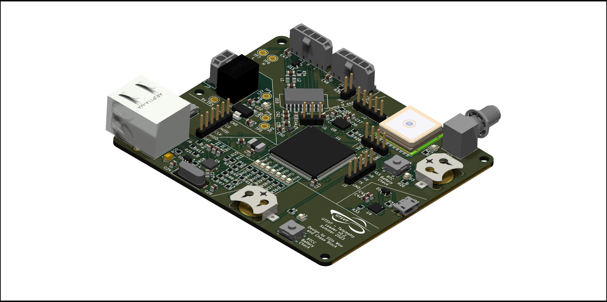

# Telemetry Leader Board
This hardware includes a GPS, IMU, SD Card Reader, CAN interface, and Ethernet interface.
The software on this board is responsible for data collection on the solar vehicle.

Authors: Chase Block and Sijin Woo
